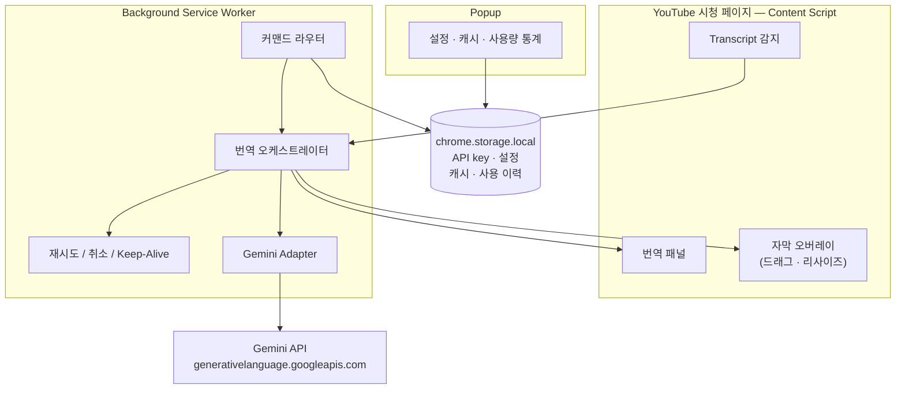

<p align="right">
  <a href="README.md">English</a>
</p>

<h1 align="center">YouTube AI Translator</h1>

<p align="center">
  <strong>Gemini 기반 문맥 인식 YouTube 자막 번역 — 브라우저에서 바로 작동합니다.</strong>
</p>

<p align="center">
  
  
  
  
</p>

<p align="center">
  <a href="docs/development.ko.md">개발 가이드</a> · <a href="docs/architecture.ko.md">아키텍처</a> · <a href="docs/transcript-regression-checklist.ko.md">회귀 체크리스트</a>
</p>

---

## 안내

이 프로젝트는 비공식 개발 도구이며 YouTube 또는 Google과 제휴, 후원, 승인 관계가 없습니다.

`YouTube`, `Gemini` 표기는 호환 대상과 동작 방식을 설명하기 위한 목적에 한해 사용됩니다.

## ✨ 어떤 확장인가요

일반 자막 번역기가 한 줄씩 처리하는 것과 달리, 이 확장은 YouTube transcript 세그먼트를 **문맥 단위 청크**로 묶어 Gemini API로 번역합니다 — 여러 세그먼트에 걸친 의미가 보존됩니다.

번역 결과는 **두 곳에 동시에** 표시됩니다: 동영상 옆 transcript 패널과 재생에 동기화되는 드래그 가능한 영상 내 오버레이.

## 🎯 주요 기능

| 기능 | 설명 |
|---|---|
| **문맥 인식 번역** | transcript 세그먼트를 청크로 묶어 일관된 문맥 번역 수행 |
| **이중 출력** | 번역된 transcript 패널 + 동기화되는 영상 내 자막 오버레이 |
| **이어받기 (Resume)** | 중단된 번역을 페이지 새로고침 후에도 이어서 실행 |
| **재번역 (Refine)** | 설정을 바꿔 현재 번들을 행 손실 없이 다시 번역 |
| **내보내기 / 가져오기** | 번역 번들을 JSON으로 저장하고 복원 |
| **캐시 관리** | 동영상별 캐시, 팝업에서 삭제·초기화·사용량 통계 확인 |
| **로컬 API Key** | 난독화 저장 — 중계 서버 없음, 외부 인증 없음 |

## 🚀 설치

### 일반 사용자 설치

1. GitHub의 **Releases** 페이지에서 최신 `youtube-ai-translator-vx.y.z.zip` 파일 다운로드
2. ZIP 압축 해제
3. **`chrome://extensions`** 열기 → **개발자 모드** 켜기
4. **압축해제된 확장 프로그램을 로드합니다** → 압축 해제 후 생성된 `youtube-ai-translator/` 폴더 선택
5. 확장 아이콘 클릭 → [Google AI Studio](https://aistudio.google.com/apikey)에서 만든 Gemini API Key 저장
6. 자막이 있는 YouTube 영상 열기 → **Open Transcript** → **Translate**

> [!TIP]
> 일반 사용자는 소스코드를 받을 필요 없이 Releases의 ZIP만 내려받아 설치하면 됩니다.

> [!TIP]
> Chrome에서 선택하는 `youtube-ai-translator/` 폴더 안에는 바로 `manifest.json` 파일이 보여야 합니다. 다른 상위 폴더를 선택하면 확장이 로드되지 않습니다.

### 소스에서 직접 빌드

```bash
git clone https://github.com/your-username/yg-translator.git
cd yg-translator
npm install
npm run build
```

1. **`chrome://extensions`** 열기 → **개발자 모드** 켜기
2. **압축해제된 확장 프로그램을 로드합니다** → `dist/` 폴더 선택
3. 확장 아이콘 클릭 → [Google AI Studio](https://aistudio.google.com/apikey)에서 만든 Gemini API Key 저장
4. 자막이 있는 YouTube 영상 열기 → **Open Transcript** → **Translate**

> [!TIP]
> API Key는 `chrome.storage.local`에 난독화 형태로 저장됩니다. 모든 Gemini 요청은 브라우저에서 직접 전송되며, 외부 서버를 경유하지 않습니다.

> [!CAUTION]
> 내보내기되거나 캐시된 자막 번들에는 저작권이 있는 자막 또는 번역문이 포함될 수 있습니다. 원본 콘텐츠에 적용되는 권리와 재배포 규칙을 준수할 책임은 사용자에게 있습니다.

## 🏗️ 동작 방식



## 📂 프로젝트 구조

```
yg-translator/
├── extension/                # 기준 소스
│   ├── adapters/             # 외부 경계 어댑터
│   │   ├── gemini/           #   Gemini API 요청/응답
│   │   ├── storage/          #   Chrome storage 접근
│   │   └── youtube/          #   YouTube DOM 전략 & fixture
│   ├── background/           # Service worker — 커맨드 라우터 & 태스크 오케스트레이션
│   ├── content/              # Content script — 패널, 오버레이, 표면 상태
│   ├── domain/               # 순수 로직 — 청킹, 재시도, 이어받기, 사용량
│   │   ├── resume/
│   │   ├── retry/
│   │   ├── transcript/
│   │   └── usage/
│   ├── popup/                # 확장 팝업 — 설정, 캐시, API key
│   └── shared/               # 타입 기반 계약 & 메시징
│       └── contracts/
├── dist/                     # 빌드된 Chrome 확장 (Chrome에 이것을 로드)
├── docs/                     # 기술 문서
│   ├── architecture.ko.md
│   ├── development.ko.md
│   └── transcript-regression-checklist.ko.md
├── vite.config.ts
├── tsconfig.json
└── package.json
```

## 🛠️ 개발

```bash
npm run dev              # Vite 개발 서버
npm run build            # 프로덕션 빌드 → dist/
npm run typecheck        # tsc --noEmit
npm test                 # Node 내장 테스트 러너
npm run check            # 전체 검증: typecheck + test + build
npm run test:coverage    # 핵심 런타임 모듈 coverage 게이트
```

> [!IMPORTANT]
> DOM 민감 변경(transcript 감지, 오버레이 동작, 팝업 흐름) 후에는 반드시 `dist/`를 Chrome에 로드해서 수동 검증합니다. 자세한 내용은 [회귀 체크리스트](docs/transcript-regression-checklist.ko.md)를 참조하세요.

## 📖 문서

| 문서 | 내용 |
|---|---|
| [개발 가이드](docs/development.ko.md) | 로컬 명령, 빌드 결과물, 확장 로드, 검증 흐름 |
| [아키텍처 스냅샷](docs/architecture.ko.md) | 런타임 경계, 타입 기반 계약, 스토리지 호환, UI 제약 |
| [Transcript 회귀 체크리스트](docs/transcript-regression-checklist.ko.md) | Fixture 기준점과 YouTube DOM 민감 작업용 수동 브라우저 점검 |

## ⚠️ 제한 사항

- YouTube 자막이 제공되는 영상에서만 동작합니다
- Gemini 할당량 또는 서비스 상태에 따라 `403`, `429`, `503` 오류가 발생할 수 있습니다
- Chrome Web Store에 등록하지 않은 상태에서는 설치 시 Chrome 개발자 모드가 필요합니다

## 📄 라이선스

[MIT License](LICENSE)로 배포됩니다.

## 📬 연락처

`imxtraa7@gmail.com`
