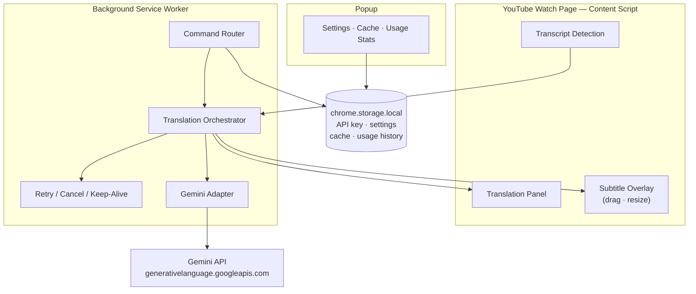

<p align="right">
  <a href="README.ko.md">한국어</a>
</p>

<h1 align="center">YouTube AI Translator</h1>

<p align="center">
  <strong>Context-aware YouTube caption translation powered by Gemini — right inside your browser.</strong>
</p>

<p align="center">
  
  
  
  
</p>

<p align="center">
  <a href="docs/development.md">Development Guide</a> · <a href="docs/architecture.md">Architecture</a> · <a href="docs/transcript-regression-checklist.md">Regression Checklist</a>
</p>

---

## Disclaimer

This is an unofficial developer tool. It is not affiliated with, endorsed by, or sponsored by YouTube or Google.

`YouTube` and `Gemini` are referenced only to describe compatibility and runtime behavior.

## ✨ What It Does

Unlike simple subtitle translators that process captions line-by-line, this extension groups YouTube transcript segments into **context-aware chunks** and translates them through the Gemini API — preserving meaning that spans across multiple segments.

Translations appear in **two surfaces simultaneously**: the transcript panel beside the video and a draggable in-video overlay that syncs with playback.

## 🎯 Key Features

| Feature | Description |
|---|---|
| **Context-Aware Translation** | Groups transcript segments into chunks for coherent, contextual translation |
| **Dual Output** | Translated transcript panel + synced in-video subtitle overlay |
| **Resume Mode** | Picks up where you left off after interruptions or page refreshes |
| **Refine** | Re-translate the current bundle with adjusted settings without losing rows |
| **Export / Import** | Save and restore translation bundles as JSON |
| **Cache Management** | Per-video cache with popup controls for delete, clear, and usage stats |
| **Local API Key** | Stored locally in obfuscated form — no relay server, no external auth |

## 🚀 Installation

### End-user install

1. Download the latest `youtube-ai-translator-vx.y.z.zip` from the GitHub **Releases** page
2. Extract the ZIP file
3. Open **`chrome://extensions`** → enable **Developer mode**
4. Click **Load unpacked** → select the extracted `youtube-ai-translator/` folder
5. Click the extension icon → save your Gemini API key from [Google AI Studio](https://aistudio.google.com/apikey)
6. Open any YouTube video with captions → **Open Transcript** → **Translate**

> [!TIP]
> End users can install directly from the release ZIP without downloading the source code or running `npm install` / `npm run build`.

> [!TIP]
> The `youtube-ai-translator/` folder you choose in Chrome should contain `manifest.json` directly. If you pick a parent folder instead, Chrome will not load the extension.

### Build from source

```bash
git clone https://github.com/your-username/yg-translator.git
cd yg-translator
npm install
npm run build
```

1. Open **`chrome://extensions`** → enable **Developer mode**
2. Click **Load unpacked** → select the `dist/` folder
3. Click the extension icon → save your Gemini API key from [Google AI Studio](https://aistudio.google.com/apikey)
4. Open any YouTube video with captions → **Open Transcript** → **Translate**

> [!TIP]
> The API key is stored in `chrome.storage.local` in obfuscated form. All Gemini requests go directly from your browser — nothing passes through an external server.

> [!CAUTION]
> Exported or cached subtitle bundles may include copyrighted caption or translation text. You are responsible for complying with the rights and redistribution rules that apply to the source content.

## 🏗️ How It Works



## 📂 Project Structure

```
yg-translator/
├── extension/                # Source of truth
│   ├── adapters/             # External boundary adapters
│   │   ├── gemini/           #   Gemini API request/response
│   │   ├── storage/          #   Chrome storage access
│   │   └── youtube/          #   YouTube DOM strategies & fixtures
│   ├── background/           # Service worker — command router & task orchestration
│   ├── content/              # Content script — panel, overlay, surface state
│   ├── domain/               # Pure logic — chunking, retry, resume, usage
│   │   ├── resume/
│   │   ├── retry/
│   │   ├── transcript/
│   │   └── usage/
│   ├── popup/                # Extension popup — settings, cache, API key
│   └── shared/               # Typed contracts & messaging
│       └── contracts/
├── dist/                     # Built Chrome extension (load this in Chrome)
├── docs/                     # Technical documentation
│   ├── architecture.md
│   ├── development.md
│   └── transcript-regression-checklist.md
├── vite.config.ts
├── tsconfig.json
└── package.json
```

## 🛠️ Development

```bash
npm run dev              # Vite dev server
npm run build            # Production build → dist/
npm run typecheck        # tsc --noEmit
npm test                 # Node built-in test runner
npm run check            # Full local gate: typecheck + test + build
npm run test:coverage    # Coverage gate for key runtime modules
```

> [!IMPORTANT]
> After DOM-sensitive changes (transcript detection, overlay behavior, popup flows), always load `dist/` in Chrome for manual verification. See the [Regression Checklist](docs/transcript-regression-checklist.md) for details.

## 📖 Documentation

| Document | What it covers |
|---|---|
| [Development Guide](docs/development.md) | Local commands, build output, extension loading, validation flow |
| [Architecture Snapshot](docs/architecture.md) | Runtime boundaries, typed contracts, storage compatibility, UI constraints |
| [Transcript Regression Checklist](docs/transcript-regression-checklist.md) | Fixture anchors and manual browser checks for YouTube DOM-sensitive work |

## ⚠️ Limitations

- Only works on videos with available YouTube captions
- Gemini quota, overload, or service errors may surface as `403`, `429`, or `503` failures
- Installation still requires Chrome Developer Mode unless the extension is published to the Chrome Web Store

## 📄 License

Released under the [MIT License](LICENSE).

## 📬 Contact

`imxtraa7@gmail.com`
