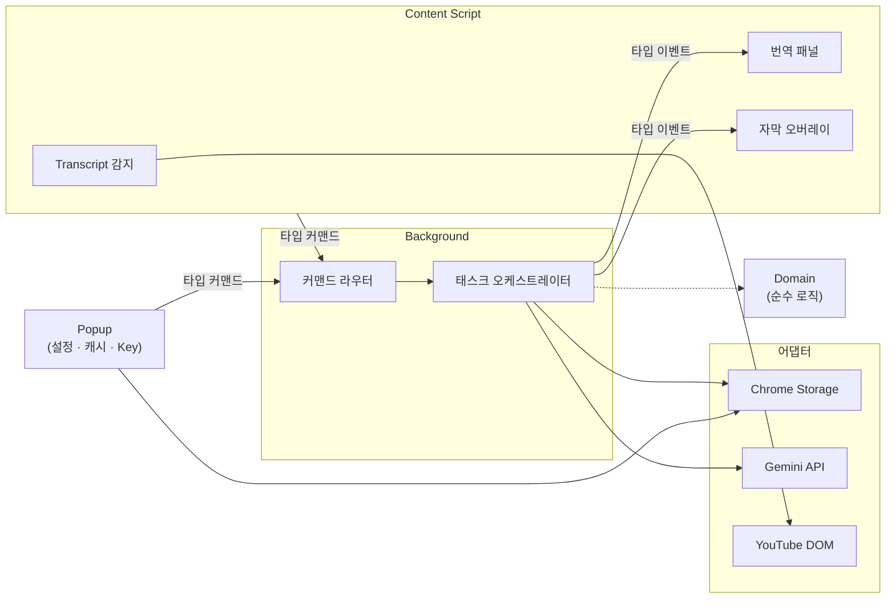
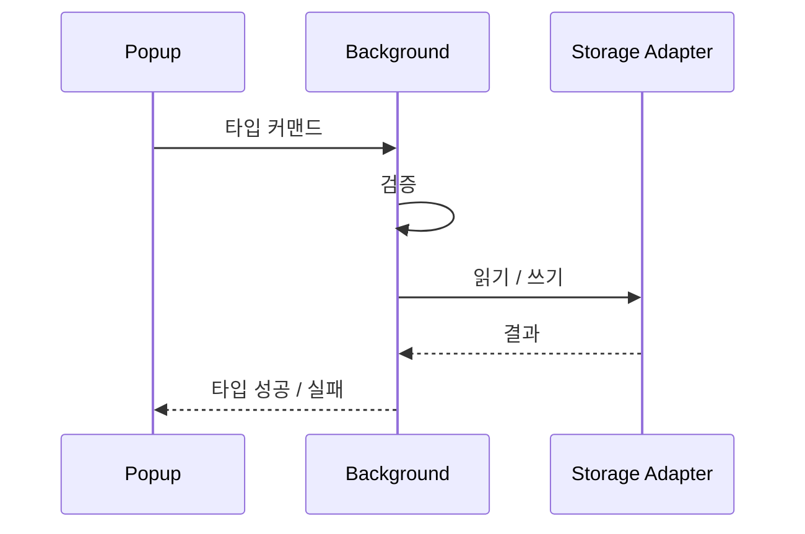
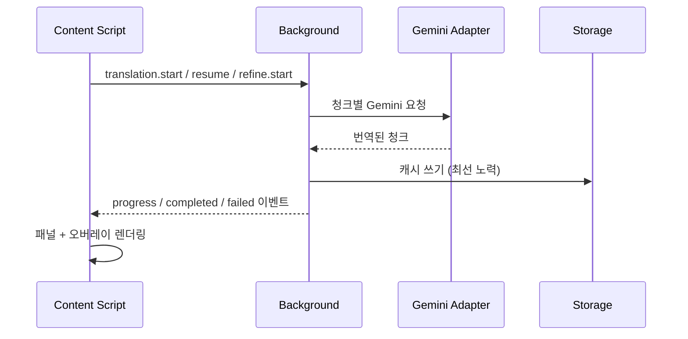

<p align="right">
  <a href="architecture.md">English</a>
</p>

# 🏛️ 런타임 아키텍처

> YouTube AI Translator Chrome 확장 (v3.0.0) 아키텍처 스냅샷.

---

## 런타임 경계

확장은 다섯 개 격리 영역으로 나뉘며, 각 영역은 단일 책임을 갖고 타입 기반 계약으로만 통신합니다.



| 영역 | 위치 | 책임 |
|---|---|---|
| **Background** | `extension/background/` | 커맨드 라우터, 번역/리파인 오케스트레이션, 재시도/취소/keep-alive |
| **Content Script** | `extension/content/` | YouTube DOM 감지, transcript 추출, 패널 & 오버레이 렌더링 |
| **Popup** | `extension/popup/` | 설정, 캐시 관리, 사용량 통계, 로컬 API key 관리 |
| **Domain** | `extension/domain/` | 순수 로직 — 청킹, 핑거프린팅, 이어받기, 사용량 집계, 에러 매핑 |
| **Adapters** | `extension/adapters/` | Chrome storage, Gemini 요청/응답, YouTube DOM 전략 |

## 디렉토리 모델

```
extension/
├── adapters/
│   ├── gemini/           # Gemini API 요청/응답 변환
│   ├── storage/          # Chrome storage 읽기/쓰기
│   └── youtube/          # DOM 전략, fixture, transcript 추출
│       └── __fixtures__/ # 레거시 & 모던 transcript DOM 스냅샷
├── background/           # Service worker 진입점, 커맨드 라우터, 태스크 오케스트레이션
├── content/              # Content script 진입점, 패널, 오버레이, 표면 상태
├── domain/               # 순수 비즈니스 로직 (브라우저 API 없음)
│   ├── resume/
│   ├── retry/
│   ├── transcript/
│   └── usage/
├── popup/                # 확장 팝업 UI, 스타일, API key 관리
└── shared/               # 타입 기반 계약 & 메시징 헬퍼
    └── contracts/        # 커맨드, 이벤트, 설정, 캐시 타입 정의
```

## 타입 기반 런타임 계약

모든 영역 간 통신은 `extension/shared/contracts/`에 정의된 타입 기반 커맨드/이벤트 쌍을 사용합니다.

### Commands (Popup / Content → Background)

| 커맨드 | 방향 | 용도 |
|---|---|---|
| `settings.get` | Popup → BG | 현재 설정 조회 |
| `settings.save` | Popup → BG | 설정 변경 저장 |
| `translation.start` | Content → BG | 새 번역 실행 시작 |
| `translation.cancel` | Content → BG | 활성 번역 중단 |
| `translation.resume` | Content → BG | 부분 캐시에서 이어받기 |
| `refine.start` | Content → BG | 현재 번들 재번역 |
| `cache.list` | Popup → BG | 캐시된 번역 목록 조회 |
| `cache.get` | Popup → BG | 특정 캐시 항목 조회 |
| `cache.import` | Content → BG | 번역 번들 가져오기 |
| `cache.delete` | Popup → BG | 단일 캐시 항목 삭제 |
| `cache.clear` | Popup → BG | 전체 캐시 삭제 |
| `usage.get` | Popup → BG | 사용량 통계 조회 |

### Page Messages (Popup → Content)

| 메시지 | 용도 |
|---|---|
| `cache.delete` | 삭제된 동영상에 대한 표면 정리 알림 |
| `cache.clear` | 모든 번역 상태 정리 알림 |

### Events (Background → Content)

| 이벤트 | 용도 |
|---|---|
| `translation.progress` | 청크 완료 진행률 |
| `translation.retrying` | 재시도 알림 |
| `translation.completed` | 전체 번역 성공 |
| `translation.failed` | 번역 에러 |
| `translation.cancelled` | 사용자 취소 |
| `refine.completed` | 리파인 성공 |
| `refine.failed` | 리파인 에러 |

## 스토리지 호환 규칙

모든 저장 키는 런타임 버전 간 하위 호환을 유지해야 합니다.

| 분류 | 키 | 비고 |
|---|---|---|
| **설정** | `targetLang`, `sourceLang`, `thinkingLevel`, `resumeMode` | 버전 간 유효 |
| **사용량** | `tokenHistory` | 단일 집계 키 |
| **API Key** | `apiKey` | 난독화, 팝업 로컬 읽기/쓰기 |
| **캐시 인덱스** | `idx_translations` | 번역 인덱스 키 |
| **캐시 데이터** | `dat_*` | 동영상별 데이터 접두사 |

> [!IMPORTANT]
> - 캐시 메타데이터는 `cacheKey`를 명시적으로 노출합니다 — 원시 YouTube 동영상 ID와 혼동 금지.
> - 스키마 버전 마커는 읽기/쓰기 시 앞으로 마이그레이션하여 3.0.0 레이아웃 호환을 유지합니다.
> - 캐시 쓰기는 가능한 경우 사람이 읽을 수 있는 제목을 보존해야 하며, 스토리지 쓰기 거부만으로 성공 결과를 실패로 격하시키면 안 됩니다.

## 데이터 흐름

### 설정 / 사용량 / 캐시



API key 읽기/쓰기는 커맨드 버스를 우회하여 공유 스토리지 어댑터를 통해 팝업 로컬에서 처리합니다.

### 번역 / 리파인



> [!NOTE]
> 잘못된 형식의 Gemini JSON은 빈 성공으로 수용되지 않고 즉시 태스크를 실패시킵니다. 캐시 쓰기는 태스크 치명 단계가 아닌 최선 노력 부수 효과입니다.

## DOM 전략 요구사항

YouTube의 transcript DOM은 렌더러 업데이트에 따라 불안정합니다. 어댑터 레이어는 레거시와 모던 구조를 모두 처리해야 합니다.

| 요구사항 | 세부 내용 |
|---|---|
| **다중 셀렉터 감지** | 패널 감지는 단일 CSS 셀렉터에 의존할 수 없음 |
| **Open/close 허용** | 자식 노드 삽입, 속성만 변경하는 가시성 전환, 구 렌더러, 신 view-model 구조를 모두 처리 |
| **네이티브 의미 보존** | 숨김/복원 시 범용 `display` 값 강제 대신 원래 렌더링 의미를 유지 |
| **마운트 위치** | 커스텀 패널 액션은 표면 핸드오프 중 숨겨질 수 있는 transcript 본문 컨테이너 바깥에 마운트 |
| **오버레이 해제** | 숨김 시 이벤트 구독을 해제하여 오래된 재생 리스너가 해제된 텍스트를 되살리지 못하게 함 |

## UI 기준선 요구사항

| 원칙 | 가이드라인 |
|---|---|
| **정보 밀도** | 주요 작업을 지원하는 최소 밀도를 기본값으로 사용 |
| **투기적 추가 금지** | 구체적 액션을 열어주지 않는 도움말, 요약 카드, 대시보드 텔레메트리 금지 |
| **팝업 레이아웃** | 사용량 요약은 간결하고 한눈에 — 안정적 2×2 통계 레이아웃 |
| **오버레이 스타일** | 의도적 제품 결정 없이는 기존 시각적 기준선 유지 |
