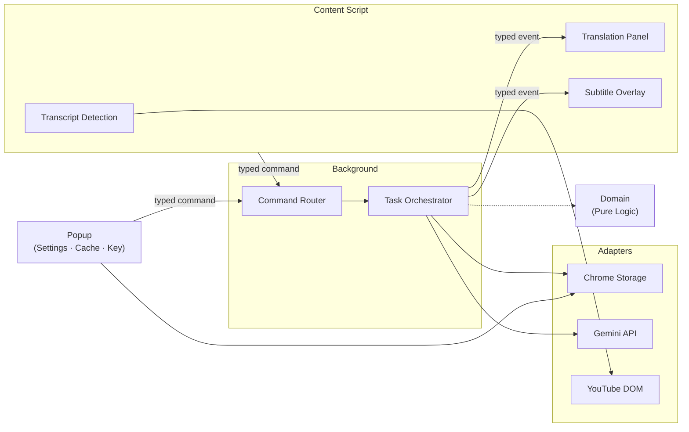
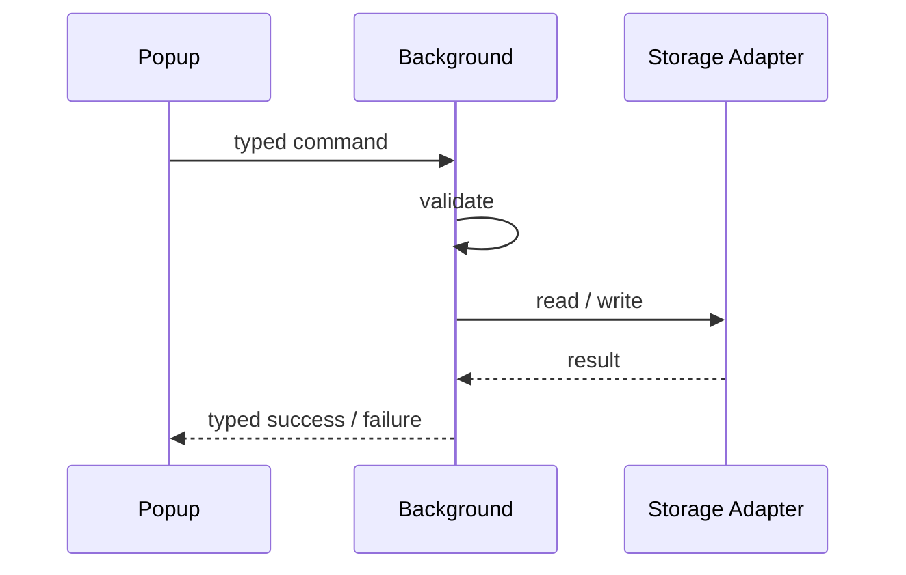
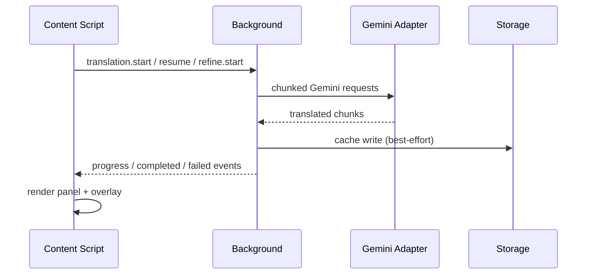

<p align="right">
  <a href="architecture.ko.md">한국어</a>
</p>

# 🏛️ Runtime Architecture

> Architectural snapshot for the YouTube AI Translator Chrome extension (v3.0.0).

---

## Runtime Boundaries

The extension is split into five isolation zones. Each zone has a single responsibility and communicates only through typed contracts.



| Zone | Location | Responsibility |
|---|---|---|
| **Background** | `extension/background/` | Command router, translation/refine orchestration, retry/cancel/keep-alive |
| **Content Script** | `extension/content/` | YouTube DOM detection, transcript extraction, panel & overlay rendering |
| **Popup** | `extension/popup/` | Settings, cache management, usage stats, local API key management |
| **Domain** | `extension/domain/` | Pure logic — chunking, fingerprinting, resume, usage aggregation, error mapping |
| **Adapters** | `extension/adapters/` | Chrome storage, Gemini request/response, YouTube DOM strategies |

## Directory Model

```
extension/
├── adapters/
│   ├── gemini/           # Gemini API request/response translation
│   ├── storage/          # Chrome storage read/write
│   └── youtube/          # DOM strategies, fixtures, transcript extraction
│       └── __fixtures__/ # Legacy & modern transcript DOM snapshots
├── background/           # Service worker entrypoint, command router, task orchestration
├── content/              # Content script entrypoint, panel, overlay, surface state
├── domain/               # Pure business logic (no browser APIs)
│   ├── resume/
│   ├── retry/
│   ├── transcript/
│   └── usage/
├── popup/                # Extension popup UI, styles, API key management
└── shared/               # Typed contracts & messaging helpers
    └── contracts/        # Command, event, settings, cache type definitions
```

## Typed Runtime Contract

All communication between zones uses typed command/event pairs defined in `extension/shared/contracts/`.

### Commands (Popup / Content → Background)

| Command | Direction | Purpose |
|---|---|---|
| `settings.get` | Popup → BG | Read current settings |
| `settings.save` | Popup → BG | Persist settings changes |
| `translation.start` | Content → BG | Begin new translation run |
| `translation.cancel` | Content → BG | Abort active translation |
| `translation.resume` | Content → BG | Continue from partial cache |
| `refine.start` | Content → BG | Re-translate current bundle |
| `cache.list` | Popup → BG | List cached translations |
| `cache.get` | Popup → BG | Retrieve specific cache entry |
| `cache.import` | Content → BG | Import translation bundle |
| `cache.delete` | Popup → BG | Delete single cache entry |
| `cache.clear` | Popup → BG | Clear all cached translations |
| `usage.get` | Popup → BG | Read usage statistics |

### Page Messages (Popup → Content)

| Message | Purpose |
|---|---|
| `cache.delete` | Notify content to clear surface for deleted video |
| `cache.clear` | Notify content to clear all translated state |

### Events (Background → Content)

| Event | Purpose |
|---|---|
| `translation.progress` | Chunk completion progress |
| `translation.retrying` | Retry attempt notification |
| `translation.completed` | Full translation success |
| `translation.failed` | Translation error |
| `translation.cancelled` | User-initiated cancellation |
| `refine.completed` | Refinement success |
| `refine.failed` | Refinement error |

## Storage Compatibility Rules

All stored keys must remain backward-compatible across runtime versions.

| Category | Keys | Notes |
|---|---|---|
| **Settings** | `targetLang`, `sourceLang`, `thinkingLevel`, `resumeMode`, `uiLocale`, `themeMode` | Translation settings remain compatible; UI preferences default forward on read |
| **Usage** | `tokenHistory` | Single aggregation key |
| **API Key** | `apiKey` | Obfuscated, popup-local read/write |
| **Cache Index** | `idx_translations` | Translation index key |
| **Cache Data** | `dat_*` | Per-video data prefix |

> [!IMPORTANT]
> - Cache metadata exposes `cacheKey` explicitly — never conflate with raw YouTube video ID.
> - Schema version markers migrate forward on read/write for 3.0.0 layout compatibility.
> - Cache writes must preserve human-readable titles when available and must never downgrade a successful result into a failure because storage rejected the write.

## Data Flow

### Settings / Usage / Cache



API key reads and writes bypass the command bus — they stay local to the popup through the shared storage adapter.

Popup-local UI preference changes also persist through `settings.save`, then fan out to the content runtime through `chrome.storage.onChanged` so the YouTube panel and overlay can re-render without a page refresh.

### Translation / Refine



> [!NOTE]
> Malformed Gemini JSON fails the task immediately — it is not accepted as an empty success. Cache writes are best-effort side effects, not task-fatal steps.

## DOM Strategy Requirements

YouTube's transcript DOM is unstable across renderer updates. The adapter layer must handle both legacy and modern structures.

| Requirement | Detail |
|---|---|
| **Multi-selector detection** | Panel detection cannot rely on a single CSS selector |
| **Open/close tolerance** | Must handle child node insertion, attribute-only visibility changes, old renderer, and new view-model structures |
| **Native semantics** | Hide/restore must preserve original rendering semantics, not force a generic `display` value |
| **Mount position** | Custom panel actions mount outside transcript body containers that may be hidden during surface handoff |
| **Overlay teardown** | Event subscriptions torn down on hide to prevent stale playback listeners from resurrecting dismissed text |

## UI Baseline Requirements

| Principle | Guideline |
|---|---|
| **Information density** | Default to the lowest density that still supports the primary task |
| **No speculative additions** | No helper copy, summary cards, or dashboard telemetry unless they unlock a concrete action |
| **Popup layout** | Usage summary stays compact and scannable — stable 2×2 stats layout; UI language + theme controls live in the hero row under the title, beside the version badge |
| **Overlay style** | Keep the established visual baseline unless an intentional product decision replaces it |
