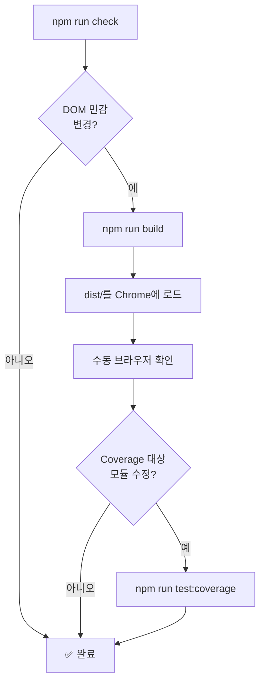

  <a href="development.md">English</a>

# 🛠️ 개발 가이드

> YouTube AI Translator 확장의 로컬 개발 워크플로우.

---

## 런타임 구조

| 디렉토리 | 용도 |
|---|---|
| `extension/` | Chrome 확장 런타임의 기준 소스 |
| `dist/` | Chrome에 로드하는 빌드 결과물 |
| `docs/` | 현재 기술 문서 |

> [!WARNING]
> Chrome에는 `extension/`을 직접 로드하지 마세요. 항상 빌드 후 `dist/`를 로드합니다.

## 로컬 명령

| 명령 | 설명 |
|---|---|
| `npm install` | 의존성 설치 |
| `npm run dev` | Vite 개발 서버 실행 |
| `npm run build` | `dist/`에 프로덕션 결과물 생성 |
| `npm run typecheck` | `tsc --noEmit` 실행 |
| `npm test` | Node 테스트 실행 (`extension/**/*.test.js`) |
| `npm run check` | **전체 검증 게이트**: typecheck + test + build |
| `npm run test:coverage` | 핵심 런타임 모듈 coverage 게이트 |

## 기본 검증 흐름

DOM 민감 변경에 해당하는 범주:

- YouTube transcript DOM 감지 또는 추출 로직
- Content surface 액션 또는 오버레이 동작
- Popup 설정, 캐시 액션, API key 흐름

## 브라우저 확인

| 단계 | 액션 |
|---|---|
| 1 | `chrome://extensions` 열기 → **개발자 모드** 켜기 |
| 2 | **압축해제된 확장 프로그램을 로드합니다** → `dist/` 폴더 선택 |
| 3 | 소스 수정 후에는 다시 빌드하고 확장 새로고침 |
| 4 | DOM 민감 작업은 [Transcript 회귀 체크리스트](transcript-regression-checklist.ko.md)를 기준으로 확인 |

> [!TIP]
> 확장 로드 후 Chrome DevTools → **Service Worker** 인스펙터로 background script 이슈를 디버깅할 수 있습니다.

## 유지보수 원칙

- 런타임 관련 문서는 항상 `extension/` 소스 트리 기준으로 맞춥니다
- 명령, 폴더 구조, 검증 기대치가 바뀌면 이 문서도 함께 갱신합니다
- 오래된 컷오버 메모는 "구 문서" 트랙으로 남기지 말고 삭제합니다
