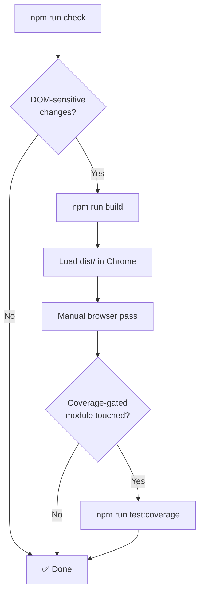

  <a href="development.ko.md">한국어</a>

# 🛠️ Development Guide

> Local development workflow for the YouTube AI Translator extension.

---

## Runtime Layout

| Directory | Purpose |
|---|---|
| `extension/` | Source of truth for the Chrome extension runtime |
| `dist/` | Loadable build output for Chrome |
| `docs/` | Current technical documentation |

> [!WARNING]
> Do not load `extension/` directly in Chrome. Always build first and load `dist/`.

## Local Commands

| Command | What it does |
|---|---|
| `npm install` | Install dependencies |
| `npm run dev` | Start Vite development server |
| `npm run build` | Create production artifact in `dist/` |
| `npm run typecheck` | Run `tsc --noEmit` |
| `npm test` | Run Node test suite (`extension/**/*.test.js`) |
| `npm run check` | **Full local gate**: typecheck + test + build |
| `npm run test:coverage` | Coverage gate for key runtime modules |

## Default Validation Flow

DOM-sensitive changes include:

- YouTube transcript DOM detection or extraction
- Content surface actions or overlay behavior
- Popup settings, cache actions, or API key flows
- Popup hero controls for UI language or theme, including any live re-render behavior

## Browser Verification

| Step | Action |
|---|---|
| 1 | Open `chrome://extensions` → enable **Developer mode** |
| 2 | Click **Load unpacked** → select `dist/` folder |
| 3 | Rebuild before reloading when source changes |
| 4 | Follow the [Transcript Regression Checklist](transcript-regression-checklist.md) for DOM-sensitive work |

When validating popup locale/theme work, manually check:

- The hero row keeps the title, compact UI language selector, compact theme selector, and version badge aligned without adding a new card
- Switching locale updates popup copy, content action labels, panel strings, and overlay tooltips without reloading YouTube
- `Theme = System` follows OS theme in the popup and YouTube dark mode in the content UI

> [!TIP]
> After loading the extension, use Chrome DevTools → **Service Worker** inspector to debug background script issues.

## Maintenance Rules

- Keep runtime-facing docs aligned with the `extension/` source tree
- Update these docs when commands, file layout, or validation expectations change
- Delete obsolete cutover notes — never maintain parallel "old vs new" documentation
